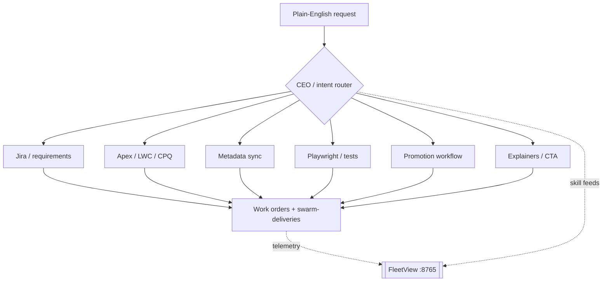

# SFDC Multi-Agent Swarm

> Package / CLI name remains **Agency-Swarm** (`sfdc-swarm`).

A Salesforce delivery swarm for [Cursor](https://cursor.com): CEO orchestration, specialist agents, LangGraph planning, and a local FleetView dashboard.

It keeps the **multi-agent pattern where it pays off** (research, routing, parallel specialist lanes) and keeps day-to-day Salesforce work grounded in real skills — Apex, LWC, metadata sync, Jira acceptance criteria, promotion, and E2E validation — instead of a giant chat blob.

Why this shape (short version):

- **Delivery work is multi-surface.** A Salesforce story often spans metadata + Apex + LWC + data/manual steps. Named specialists beat one overloaded agent.
- **Research / routing can be parallel.** Intent routing and knowledge refresh are a good fit for swarm + judge patterns.
- **Coding still needs a single owner.** The implementer lane stays focused; reviewers and gates stay independent. No agent certifies its own work.
- **Filesystem + org context are source of truth.** The swarm reads your SFDX project and `sf` target org — nothing org-specific is hardcoded in this repo.

Inspired by [Agency Swarm](https://github.com/VRSEN/agency-swarm), adapted for Salesforce DX delivery inside Cursor.

---

## Quickstart

You need: **Cursor**, **Python 3.9+** (3.11 recommended), **Node 18+**, **Salesforce CLI (`sf`)**, **Git**, and an **SFDX project** (`sfdx-project.json`).

```bash
git clone https://github.com/Lakshmikanth-Paruchuru/sfdc-multi-agent-swarm.git
cd Agency-Swarm
pip install -r framework/requirements.txt
./install.sh
./scripts/install-skills.sh

# Wire into your Salesforce DX project
./scripts/install-to-project.sh --global-skills /path/to/your-sfdx-project

# From the DX project
cd /path/to/your-sfdx-project
sf org login web --alias MY_SANDBOX --instance-url https://test.salesforce.com
sf config set target-org MY_SANDBOX
sfdc-swarm context                              # project + org
sfdc-swarm serve                                # FleetView → http://127.0.0.1:8765
sfdc-swarm orchestrate "Implement feature X"    # LangGraph work orders
```

Also put `~/.local/bin` on your `PATH` (where the `sfdc-swarm` shim lands):

```bash
echo 'export PATH="$HOME/.local/bin:$PATH"' >> ~/.zshrc && source ~/.zshrc
```

### Using it inside Cursor

Open your wired SFDX project in Cursor and describe work in plain English, or `@agency-swarm-cursor` for CEO mode. [`AGENTS.md`](templates/project/AGENTS.md) (copied into the project) gives Cursor the agency chart.

### What works with zero API keys

After install only (no `CURSOR_API_KEY`):

- `sfdc-swarm --help` / `context` / `fleet` / `agency-sync`
- `sfdc-swarm serve` (FleetView)
- `sfdc-swarm skill-refresh --tier manifest|weekly`
- Offline `orchestrate` routing + work-order scaffolding
- `python3 tests/test_framework.py`

Live Apex/LWC implementation via Cursor agents needs `CURSOR_API_KEY` ([dashboard](https://cursor.com/dashboard/integrations)).

---

## Architecture

```
plain-English ask
        │
        ▼
   CEO / router ──► specialist teams (Jira, Apex/LWC, metadata, QA, promo, docs)
        │
        ├─► LangGraph orchestrate → work orders / delivery records
        ├─► skill-refresh → local knowledge-base (token-light tiers)
        └─► FleetView (serve) → live dashboards on :8765
```



**Two paths (keep them distinct):**

| Path | Entry | What it does |
|------|--------|--------------|
| **A — Orchestrate** | `sfdc-swarm orchestrate "..."` | LangGraph planning, team routing, work-order scaffolding |
| **B — Cursor CEO** | Chat / `@agency-swarm-cursor` | Cursor specialists with agency instructions + skills |

Intent routing preference: Cursor SDK → Anthropic → keyword fallback (`INTENT_TO_TEAMS` in `framework/agents_registry.py`).

---

## Live demo (video)

FleetView walkthrough against a local install (fixture SFDX project — no customer org data):

**[▶ Watch demo video](docs/blog/assets/agency-swarm-fleetview-demo.webm)** · [Poster](docs/blog/assets/agency-swarm-fleetview-poster.png)

What it shows: Skills Fleet, orchestrator home, Swarm Fleet + Dev Swarm dashboards.

Re-record locally (Playwright + browsers):

```bash
# terminal 1 — wired SFDX project
sfdc-swarm serve --port 8770

# terminal 2
export PLAYWRIGHT_BROWSERS_PATH="$HOME/Library/Caches/ms-playwright"
FLEET_URL=http://127.0.0.1:8770 OUT_DIR=/tmp/agency-rec \
  node path/to/Agency-Swarm/scripts/record-fleetview-demo.mjs
```

---

## Setup

```bash
python3 -m pip install -r framework/requirements.txt
./install.sh
./scripts/install-skills.sh
```

Installs:

- `~/.cursor/sfdc-knowledge-swarm` — framework copy
- `~/.local/bin/sfdc-swarm` — CLI
- `~/.cursor/skills/*` — specialist skills (Apex, metadata, Jira, promotion, Playwright, explainers, …)

For live Cursor agents, also install the SDK into the global swarm home:

```bash
cd /tmp && npm install @cursor/sdk @bufbuild/protobuf
mkdir -p ~/.cursor/sfdc-knowledge-swarm/node_modules
cp -r /tmp/node_modules/@cursor ~/.cursor/sfdc-knowledge-swarm/node_modules/
cp -r /tmp/node_modules/@bufbuild ~/.cursor/sfdc-knowledge-swarm/node_modules/
```

### Optional env / MCP

| Item | Setup | Unlocks |
|------|--------|---------|
| Cursor API key | `export CURSOR_API_KEY=cursor_...` | Live specialist agents in `orchestrate` |
| Anthropic API key | `export ANTHROPIC_API_KEY=sk-ant-...` | LLM intent-router fallback |
| Atlassian MCP | Cursor MCP | Jira / Confluence |
| Google Workspace MCP | Cursor MCP | Drive / Docs / Sheets |
| `swarm.config.json` | Copy from repo root into your DX project | Jira key, promotion-repo hints |

No org alias is hardcoded. The swarm reads `.sf/config.json` / `sf config get target-org`.

---

## Usage

```bash
# From a wired SFDX project
sfdc-swarm context
sfdc-swarm serve                                 # http://127.0.0.1:8765
sfdc-swarm orchestrate "Add FLS checks to Order service"
sfdc-swarm skill-refresh --tier weekly           # token-light KB refresh
sfdc-swarm agency-sync                           # regenerate .cursor/agency from registry

# Deep E2E (no API keys required for most checks)
cd /path/to/Agency-Swarm
python3 tests/test_framework.py
# or:
./scripts/validate-e2e.sh
```

### When to use the swarm

| Use | Skip |
|-----|------|
| Stories spanning metadata + Apex + LWC + promotion | One-line typo fixes |
| Retrieve → implement → test → promote with traceability | Quick SOQL / single-method edits |
| Onboarding a large repo / architecture explainers | Simple chat Q&A |

---

## FleetView (visualize the swarm)

```bash
sfdc-swarm serve          # binds 127.0.0.1:8765
# open http://127.0.0.1:8765
```

What it shows:

- **Skills Fleet** — agents, skills, fleet health
- **Orchestrator home** — run / delivery pipeline
- **Swarm Fleet** + **Dev Swarm** — team views and status

---

## Config

Copy [`swarm.config.json`](swarm.config.json) into your SFDX project root and fill in:

- `jira.project_key` / `jira.base_url`
- `promotion.repo_name` (your metadata promotion repo; discoverable via `SFDC_PROMOTION_REPO` env or a sibling folder such as `your-promotion-repo`)
- optional Slack / model overrides

Skill-refresh tiers include: `manifest`, `connected`, `open_light`, `open_deep`, `daily`, `weekly`, `monthly`, `all_light`.

---

## Guardrails / non-goals

- **Human-owned deploys.** Retrieve and verify freely; do not silently `sf project deploy` — promotion stays explicit.
- **No org secrets in this repo.** Named Credentials, tokens, and customer data stay in your DX project / org.
- **No private project names in public templates.** Consumer projects keep local KB under `knowledge-base/` and fleet state under `.cursor/swarm/`.
- If you cannot name the constraint an extra agent relieves (context isolation, parallelism, or independent verification), stay single-agent in Cursor chat.

---

## Layout

```
Agency-Swarm/
├── framework/                 # LangGraph orchestrator, FleetView, CLI, KB indexer
├── templates/
│   ├── cursor/
│   │   ├── agency/            # Per-agent instructions (CEO, specialists)
│   │   ├── agents/            # Cursor subagent definitions
│   │   ├── rules/             # Cursor rules (CEO attach, Salesforce globs)
│   │   └── skills/            # Global Cursor skills
│   └── project/
│       ├── AGENTS.md          # Copied into DX projects
│       └── project-topics.example.json
├── docs/                      # Architecture, blog, guides
├── scripts/                   # install-to-project, install-skills, demo recorder
├── tests/                     # Framework E2E suite
├── install.sh                 # Global CLI → ~/.cursor/sfdc-knowledge-swarm
└── swarm.config.json          # Example project config
```

**Not in this repo (runtime, per DX project):**

| Path | Lives in |
|------|----------|
| `knowledge-base/codebase/*.md` | Each DX project |
| `.cursor/swarm/.fleet/` | Each DX project |
| `docs/swarm-deliveries/` | Each DX project |

---

## Updating consumer projects

```bash
cd Agency-Swarm && git pull
./framework/install-global.sh
cd /path/to/your-sfdx-project
/path/to/Agency-Swarm/scripts/install-to-project.sh --global-skills .
sfdc-swarm agency-sync    # optional — regenerate agency folders
```

Change agents or skill feeds in `framework/agents_registry.py`, then `sfdc-swarm agency-sync` from a wired project.

---

## Documentation

| Doc | Description |
|-----|-------------|
| [SETUP.md](SETUP.md) | Full setup walkthrough |
| [docs/ARCHITECTURE.md](docs/ARCHITECTURE.md) | Pipelines, agent roster, FleetView APIs |
| [docs/FRAMEWORK-README.md](docs/FRAMEWORK-README.md) | CLI reference |
| [docs/blog/20260624-sfdc-agent-swarm-blog.html](docs/blog/20260624-sfdc-agent-swarm-blog.html) | Narrative overview + screenshots |

---

## Validation

```bash
pip install -r framework/requirements.txt
python3 tests/test_framework.py
```

CI template: copy `docs/ci/github-actions-validate.yml` to `.github/workflows/validate.yml` (GitHub token with `workflow` scope).

